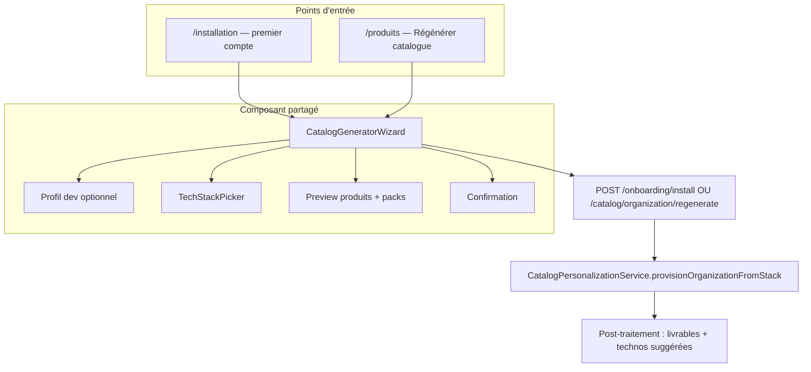

# Roadmap — Seed catalogue, générateur produits et réinitialisation

> **Statut** : planifié (juin 2026)  
> **Branche de référence** : `feature/catalogue-produits-stack` (commit `c5dc730` et suivants)  
> **Objectif** : enrichir le parcours d’installation, réutiliser le même générateur sur la page Produits, et améliorer les suggestions (produits, technos, livrables, clients).

---

## Contexte — ce qui existe déjà

### Inscription (`/signup`)

- Crée **organisation vide** + utilisateur (pas de produits, pas de clients catalogue).
- Redirection : `/installation` après session.

### Wizard d’installation (`/installation`)

Fichier : `frontend/src/modules/app/pages/OnboardingInstallPage.tsx`

| Étape | Contenu | Persisté ? |
|-------|---------|------------|
| 0 Bienvenue | `OnboardingDevWelcomeStep` | — |
| 1 Profil | freelance / indie / studio / student… | **Non** (state local `devProfile` uniquement) |
| 2 Stack | `TechStackPicker` (min 2 technos) | Oui → `preferredTechnologies` |
| 3 Validation | preview produits + packs optionnels | Packs oui (install séparé) |
| 4 Installation | `onboardingService.install()` | Oui → clone catalogue org |

Backend : `POST /api/onboarding/install` → `CatalogPersonalizationService.provisionOrganizationFromStack()`  
→ **supprime** les produits org existants, **clone** les templates globaux (`organizationId: null`) selon scoring `catalog-match-rules.json`.

### Templates globaux (seed dev / prod)

- `server/prisma/seeds/dev-products.catalog.ts` — ~40 prestations DanielCraft
- `server/prisma/seeds/products.seed.ts` — upsert `organizationId: null`
- Règles : `server/data/catalog/catalog-match-rules.json`
- Packs : `server/data/catalog/catalog-packs.json`

### Page Produits (`/produits`)

- CRUD manuel, `EditProductDialog` (stepper : identité, classification, offre, technos, visuel, récap)
- Suggestions techno à la création : `suggestTechStackFromClassification()` (`frontend/src/modules/products/utils/suggestTechStack.ts`)
- Catalogue livrables org : autocomplete + sync à l’enregistrement produit (`DeliverableCatalogItem`)
- **Pas d’UI** pour relancer le générateur catalogue

### API backend déjà prête (non branchée UI Produits)

| Route | Rôle |
|-------|------|
| `GET /catalog/organization` | `productIds` + `preferredTechnologies` |
| `POST /catalog/organization/regenerate` | Wipe + reclone catalogue (`assignOrganizationCatalog`, source `manual`) |
| `GET /catalog/packs` + `POST /catalog/packs/:id/install` | Packs métier (déjà utilisés à l’install) |

`catalogService` frontend : **manque** `getOrganizationCatalog()` et `regenerateOrganizationCatalog()`.

---

## Vision produit

1. **Nouveau compte** : après choix stack (+ profil), catalogue **riche** : produits avec technos, livrables structurés, tarifs cohérents.
2. **Clients de départ** : proposer des fiches types (personas / contacts déjà vus ailleurs) — voir § Clients ci-dessous.
3. **Page Produits** : bouton **« Régénérer mon catalogue »** qui rouvre le même assistant que l’onboarding (stack → preview → confirmation destructive).
4. **Cohérence** : une seule logique de génération (`provisionOrganizationFromStack` / `regenerate`), pas deux chemins divergents.

---

## Lacunes actuelles (à combler)

| Sujet | État | Impact |
|-------|------|--------|
| Profil dev (étape 1) | UI seulement | Packs `suggestedProfiles` non filtrés ; scoring catalogue ignore le profil |
| Livrables à l’install | Absents | `details[]` vides sur produits clonés ; catalogue livrables org vide au départ |
| Technos sur produits clonés | Partielles | Dépend des données template global ; pas de post-traitement `suggestTechStack` |
| Clients à l’onboarding | Absents | Pas d’étape ni seed clients types |
| Régénération depuis Produits | API oui, UI non | Utilisateur bloqué s’il veut « recommencer » |
| Templates globaux en prod | Dépend du deploy | Sans `seedProducts`, install onboarding clone 0 produit |

---

## Architecture cible

### Extraction UI recommandée

Créer `frontend/src/modules/catalog/CatalogGeneratorWizard.tsx` (ou `modules/onboarding/CatalogGeneratorWizard.tsx`) en factorisant les étapes 1–3 de `OnboardingInstallPage` :

- Props : `mode: 'onboarding' | 'regenerate'`, `initialTechnologyIds?`, `initialDevProfile?`, `onComplete`
- `OnboardingInstallPage` : garde étape 0 bienvenue + étape 4 animation, délègue le cœur au wizard
- `ProductsPage` : dialog plein écran ou drawer avec `mode="regenerate"`

---

## Phases d’implémentation

### Phase 1 — Brancher la réinitialisation sur la page Produits (quick win)

**Priorité** : haute — API déjà là.

**État (juin 2026)** : en cours — `/installation` accessible en mode replay ; bouton « Régénérer catalogue » sur `/produits` → assistant partagé.

| Tâche | Fichiers | Statut |
|-------|----------|--------|
| `catalogService.getOrganizationCatalog()` | `frontend/src/services/catalogService.ts` | ✅ |
| `catalogService.regenerateOrganizationCatalog(ids)` | idem | ✅ |
| `/installation` sans redirect si onboarding déjà fait | `OnboardingInstallPage.tsx` | ✅ |
| Bouton « Régénérer catalogue » → `/installation?returnTo=/produits` | `ProductsPage.tsx` | ✅ |
| Confirmation destructive (alerte + bouton Annuler) | `OnboardingInstallPage.tsx` | ✅ |
| Après succès : `markAsStale`, `refresh`, `prefetchCatalog` | `ProductsPage.tsx` | ✅ |
| Tests e2e `POST /catalog/organization/regenerate` | `catalog-signup-products.e2e-spec.ts` | ⬜ |
| Extraire `CatalogGeneratorWizard` (dialog embarqué optionnel) | — | ⬜ |

**UX Produits** (proposition) :

- Bouton secondaire dans la barre d’outils : **« Régénérer depuis ma stack »** (icône `Autorenew` ou `Layers`)
- Sous-texte : « Reprend les choix de l’installation — remplace vos produits actuels »
- Option future : lien « Modifier ma stack sans tout effacer » (merge, phase 4)

---

### Phase 2 — Enrichir le seed à l’installation (nouveau compte)

**Priorité** : haute — valeur à la première connexion.

**État (juin 2026)** : en cours — `devProfile` persisté, packs filtrés, index livrables post-clone, icônes TechStackPicker.

#### 2a. Persister le profil développeur

- Champ `Organization.devProfile` (enum : `freelance` | `indie` | `studio` | `student` | `other`) ou JSON metadata — ✅ migration `20260608210000_org_dev_profile`
- Envoyer `devProfile` dans `POST /onboarding/install` — ✅
- Filtrer packs étape 3 : `catalog-packs.json` → `suggestedProfiles` — ✅ + pré-sélection packs profil

#### 2b. Produits clonés plus complets

Après clone dans `provisionOrganizationFromStack` :

1. **Technos** : pour chaque produit org sans `techStack` (ou minimal), appliquer la même logique que `suggestTechStackFromClassification` côté serveur (nouveau util `product-tech-suggest.server.ts` miroir du front) + stack utilisateur.
2. **Livrables** : templates globaux portent `details[]` dans `dev-products.catalog.ts` — clone conserve `details` ; `DeliverablesCatalogService.syncAllFromOrganizationProducts` après provision — ✅
3. **SKU** : normaliser via `product-sku.util.ts` si manquant.

Fichiers seed à enrichir :

- `server/prisma/seeds/dev-products.catalog.ts` — `details`, `techStack`, `purpose`, `category` sur chaque prestation
- `server/data/catalog/catalog-match-rules.json` — règles par profil (bonus SKUs junior/student)

#### 2c. Garantir les templates en production

- Documenter dans `scripts/deploy/README.md` : exécution `seedProducts` (ou job dédié) pour `organizationId: null`
- Test de smoke : install onboarding avec DB prod-like → `clonedCount > 0`

---

### Phase 3 — Clients au démarrage

**Décision produit requise** — trois options :

| Option | Description | Complexité | RGPD |
|--------|-------------|------------|------|
| **A. Personas globaux** | Fiches types seed (`organizationId: null`) : « Startup SaaS », « Agence locale »… l’utilisateur coche celles à importer | Faible | OK |
| **B. Autres orgs du même utilisateur** | Si email a déjà une org, proposer d’importer **noms** de clients (sans données sensibles) | Moyenne | À cadrer |
| **C. Répertoire DanielCraft** | Liste fixe de secteurs / types de clients web (comme les packs produits) | Faible | OK |

**Recommandation** : commencer par **A + C** (pas de fuite cross-tenant).

Implémentation suggérée :

- Nouvelle étape wizard (optionnelle) : **« Vos types de clients »** après validation catalogue
- `POST /onboarding/install` étendu : `clientArchetypeIds?: string[]`
- Service : clone ou création clients depuis `server/data/catalog/client-archetypes.json`
- Lier `preferredTechnologies` client → `assignClientCatalog` existant

---

### Phase 4 — Améliorations avancées (plus tard)

- **Merge régénération** : ajouter produits manquants sans wipe (mode `append` vs `replace`)
- **Réinitialisation partielle** : uniquement livrables catalogue, ou uniquement technos sur produits existants
- **Import API** : déjà documenté (`catalog-import`) — lien depuis le wizard regenerate
- **Onboarding rejouable** : lien Paramètres → « Reconfigurer mon installation »
- **Profil expert/junior** dans scoring : utiliser `starterProfileSkus` des seeds

---

## Fichiers de référence

### Onboarding

| Fichier | Rôle |
|---------|------|
| `frontend/src/modules/app/pages/OnboardingInstallPage.tsx` | Wizard 5 étapes |
| `frontend/src/modules/onboarding/steps/*` | Bienvenue, profil |
| `frontend/src/components/catalog/TechStackPicker.tsx` | Sélection stack |
| `frontend/src/services/onboardingService.ts` | preview / install |
| `server/src/onboarding/onboarding.service.ts` | Orchestration BE |
| `server/src/catalog/catalog-personalization.service.ts` | Scoring + clone |

### Produits & suggestions

| Fichier | Rôle |
|---------|------|
| `frontend/src/modules/products/components/EditProductDialog.tsx` | Formulaire stepper |
| `frontend/src/modules/products/utils/suggestTechStack.ts` | Suggestions techno |
| `server/src/products/deliverables-catalog.service.ts` | Index livrables org |
| `server/prisma/seeds/dev-products.catalog.ts` | Source prestations |

### Page Produits (cible régénération)

| Fichier | Rôle |
|---------|------|
| `frontend/src/modules/products/ProductsPage.tsx` | Point d’entrée bouton regenerate |
| `frontend/src/services/catalogService.ts` | À étendre |
| `server/src/catalog/catalog.controller.ts` | `organization/regenerate` |

---

## Critères d’acceptation (résumé)

### Régénération page Produits

- [ ] Bouton visible pour admin org avec catalogue déjà installé
- [ ] Wizard reprend `preferredTechnologies` actuelles
- [ ] Confirmation avant wipe
- [ ] Liste produits rafraîchie sans rechargement page
- [ ] e2e : regenerate → anciens produits org supprimés, nouveaux présents

### Install enrichi

- [ ] `devProfile` persisté sur l’organisation
- [ ] Produits clonés ont `techStack` + `details` (livrables) exploitables dans devis/PDF
- [ ] Catalogue livrables org non vide après install (≥ N entrées)
- [ ] Packs suggérés selon profil

### Clients (phase 3)

- [ ] Au moins 3 archétypes importables à l’install
- [ ] Aucune donnée d’une autre organisation exposée sans consentement explicite

---

## Ordre de travail recommandé

1. **Phase 1** — UI regenerate sur Produits (1–2 jours)
2. **Phase 2b** — Enrichir `dev-products.catalog.ts` + sync livrables post-clone (1–2 jours)
3. **Phase 2a** — Persister `devProfile` + filtres packs (0,5–1 jour)
4. **Phase 3** — Archétypes clients + étape wizard (2–3 jours)
5. **Phase 4** — selon retours utilisateurs

---

## Liens

- [Positionnement prestations services](./POSITIONNEMENT_PRESTATIONS_SERVICES.md)
- [Roadmap globale](./ROADMAP.md)
- Doc API publique : section « Import catalogue » (`frontend/src/modules/api-access/apiDocsContent.ts`)
