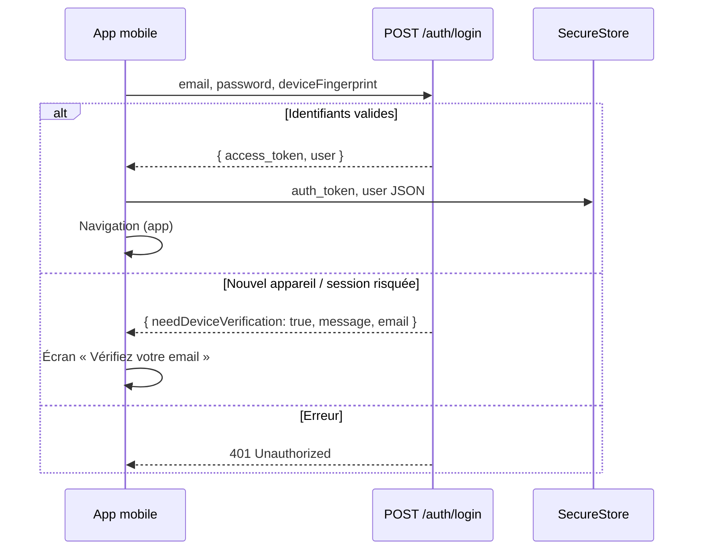

# Authentification mobile

L’app mobile réutilise l’API NestJS existante (`server/src/auth`). Pas de cookie HTTP-only : le token JWT est stocké localement et envoyé en **Bearer**.

## Flux connexion



## Endpoints utilisés

| Méthode | Route | Rôle |
|---------|-------|------|
| `POST` | `/auth/login` | Connexion email + mot de passe |
| `POST` | `/auth/logout` | Révoque la session serveur |
| `GET` | `/auth/me` | Profil utilisateur courant |
| `POST` | `/auth/verify-device` | Confirme un nouvel appareil (token email) |
| `POST` | `/auth/session/bootstrap` | Rafraîchit le JWT si session cookie déjà valide (web uniquement en pratique) |

### Corps `POST /auth/login`

```json
{
  "email": "user@example.com",
  "password": "secret",
  "deviceFingerprint": "mobile-abc123-stable"
}
```

### Réponse succès

```json
{
  "access_token": "eyJhbG…",
  "user": {
    "id": "1",
    "email": "user@example.com",
    "firstName": "Jean",
    "lastName": "Dupont",
    "role": "OWNER",
    "emailVerified": true,
    "organization": { "id": "1", "name": "Mon entreprise" }
  }
}
```

### Réponse vérification appareil

```json
{
  "needDeviceVerification": true,
  "message": "Connexion depuis un nouvel appareil…",
  "email": "u***@example.com"
}
```

## Stockage local

| Clé | Contenu | Stockage |
|-----|---------|----------|
| `auth_token` | JWT | `expo-secure-store` (prod) / AsyncStorage (web dev) |
| `user` | Profil sérialisé | idem |
| `device_fingerprint` | UUID stable par installation | SecureStore |

Le client HTTP ajoute automatiquement :

```
Authorization: Bearer <auth_token>
```

## Empreinte appareil (`deviceFingerprint`)

Aligné sur le web (`LoginDto.deviceFingerprint`). Généré une fois par installation :

1. Lire UUID existant dans SecureStore
2. Sinon créer `mobile-<uuid>` et persister

Permet au backend (`AuthSessionService`) de détecter un nouvel appareil et d’envoyer l’email de confirmation si nécessaire.

## Déconnexion

1. `POST /auth/logout` avec Bearer (révoque `UserSession` côté serveur)
2. Suppression locale `auth_token` + `user`

## Configuration dev

Copier `.env.example` → `.env` :

```env
EXPO_PUBLIC_API_URL=http://192.168.x.x:3000/api
```

- **Android émulateur** : `http://10.0.2.2:3000/api`
- **iOS simulateur** : `http://localhost:3000/api`
- **Appareil physique** : IP LAN du poste qui exécute NestJS

Le backend doit être joignable sans cookie ; le JWT suffit.

## Sécurité

- Ne jamais logger le token en clair
- Préférer HTTPS en production (`https://prestafacture.com/api`)
- Expiration JWT : 24 h (config `JwtModule` serveur) — prévoir refresh ou re-login
